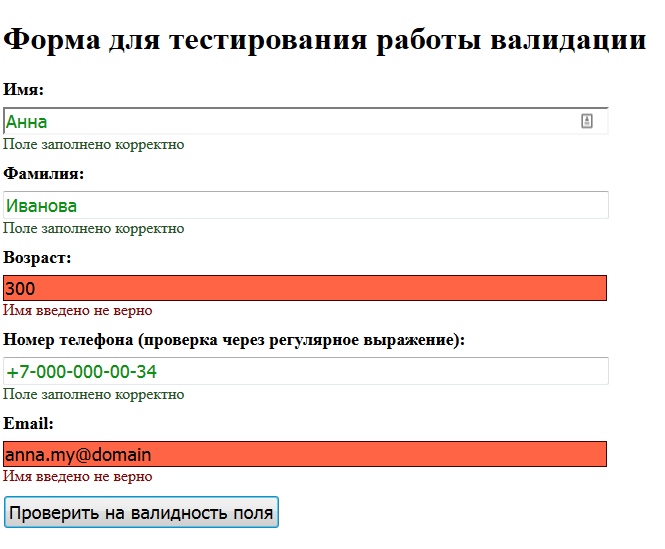

# Плагин для jQuery, который осуществляет валидацию полей с данными
pluginJqueryValidForm - плагин написан на JavaScript ES5, является расширяемым (можно добавить свои валидаторы и переопределить параметры), предназначен для валидации полей форм на клиенте.
Поддерживаемые браузеры: IE9+, 2 последние версии современных браузеров.



## Этапы установки
- Скачать архив с плагином или клонировать репозеторий git с плагином.
- Распоковать архив и скопировать плагин в папку с проектом.
- Скачать и подключить библиотеку jQuery с официального сайта (https://jquery.com/) или выполнить следующую команду в корне проекта:
```html
bower install
```
- Подключить js файл плагина - dist/jquery.plugin-jquery-valid-form.js
- Подключить файл со стилями - dist/jquery.plugin-jquery-valid-form.css

## Демо версия плагина
В папке demo находится демонстрация работы плагина. Просто откройте страницу demo/index.html в браузере.

## Свои темы
Вы можете переопределить стандартные параметры при вызове пагина путем передачи объекта конфигурации.
Пример:
```html
$(document).ready(function () {
            //Подключение (активация плагина)
            $('form.main-test-form').validForm({
                classErrorMessage: 'v-error-yellow',
                classBgError: 'v-bg-error-yellow',
            });
        });
``` 
В данном примере переопределены названия классов для текстового сообщения и самого поля, добавляемые при ошибке валидации.
Все параметры с описаниями можно найти в файле плагина dist/jquery.plugin-jquery-valid-form.js
```html
//Параметры по умолчанию
var defaults = {
    //Класс, который добавляется, если поле заполнено неверно
    classErrorMessage: 'v-error',
    //Класс, если поле заполнено с ошибкой
    classBgError: 'v-bg-error',
    //Класс, если поле заполнено правитьно
    classSuccessMessage: 'v-success',
    //Добавлять ли readonly к полям, которые уже заполнены верно
    successFieldDisabled: true,
    //Класс, добавляемый к полю вместе с атрибутом readonly
    classDisabled: 'v-disabled'
};
```
## Доступные валидаторы
Плагин включает в себя 4 валидатора
- string - проверка для строковых значений;
- number - проверка для числовых зачений;
- email - проверка значения поля на соответствие электронному адресу почты;
- pattern - проверка значения поля на соответствие регулярному выражению.

Можно, также, добавить свои валидаторы. Для этого необходимо написать метод проверки поля и добавить его в switch, где происходит выбор валидаторов.
```html
//Проверки
switch (dataValidator) {
    //Валидатор string
    case 'string':
        isOk = validatorString(item);
        resultValidator(item, isOk, dataSuccess, dataError);
        break;
    //Валидатор number
    case 'number':
        isOk = validatorNumber(item);
        resultValidator(item, isOk, dataSuccess, dataError);
        break;
```

## Пример добавления поля формы с проверкой на строковое значение
```html
<div class="v-form-group">
    <label for="name-user">Имя:</label>
    <input type="text" id="name-user" name="name-user"
           data-v-validator="string"
           data-v-min="2"
           data-v-max="20"
           data-v-required="true"
           data-v-pattern="^[а-яА-ЯёЁ]+$"
           data-v-success="Поле заполнено корректно"
           data-v-error="Имя введено не верно">
</div>
```